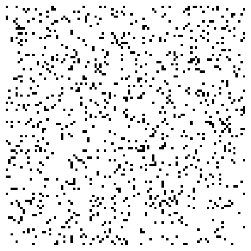

# Conway's Game of Life

Conway's Game of Life, devised by mathematician John Conway in 1970, is a classic example of a cellular automaton. Despite its simple rules, the Game of Life exhibits complex behavior and has fascinated generations of mathematicians, computer scientists, and enthusiasts.

## Introduction

The Game of Life is played on an infinite two-dimensional grid of cells, each of which can be in one of two possible states: alive or dead. The grid evolves over discrete time steps according to a set of rules based on the states of neighboring cells. Despite its name, the Game of Life is not a game in the conventional sense, as it has no players and no defined goal. Instead, it serves as a fascinating model of emergent behavior and self-organization.

## Rules

The rules of Conway's Game of Life are simple yet powerful:

1. **Birth**: A dead cell with exactly three live neighbors becomes a live cell (is "born").
2. **Survival**: A live cell with two or three live neighbors remains alive.
3. **Death**: A live cell with fewer than two live neighbors dies of loneliness, while a live cell with more than three live neighbors dies of overcrowding.

These rules are applied simultaneously to every cell in the grid, resulting in the generation of new patterns and configurations over time.

## Patterns and Behaviors

Conway's Game of Life gives rise to a rich variety of patterns and behaviors, including static patterns that remain unchanged (known as "still lifes"), oscillating patterns that repeat periodically, and moving patterns or "spaceships" that translate across the grid. Some patterns, such as the famous "Gosper glider gun," can generate other patterns indefinitely, leading to endless complexity.

## Applications

Beyond its recreational and theoretical significance, Conway's Game of Life has found applications in various fields, including computer science, biology, and artificial life. It serves as a testbed for exploring concepts such as pattern formation, complexity, and emergent phenomena. Additionally, it has inspired the development of new algorithms and computational techniques.

In summary, Conway's Game of Life is a captivating example of a simple system giving rise to intricate and unpredictable behavior. Its elegance lies in its minimalist ruleset, which belies the complexity of the patterns it generates.

# Conway's Game of Life ASCII Examples

## Still Lifes

Still lifes are configurations that remain unchanged over successive generations.

### Block

### Beehive

### Loaf

### Boat

### Tub

## Oscillators

Oscillators are configurations that return to their original state after a finite number of generations.

### Blinker (Period 2)

### Toad (Period 2)

### Beacon (Period 2)

### Pulsar (Period 3)

### Pentadecathlon (Period 15)

## Spaceships

Spaceships are patterns that translate themselves across the grid as they evolve.

### Glider

### Lightweight Spaceship (LWSS)

### Middleweight Spaceship (MWSS)

### Heavyweight Spaceship (HWSS)

These examples provide a glimpse into the diverse patterns that emerge in Conway's Game of Life. The interactions between cells governed by simple rules give rise to complex and visually captivating behavior.